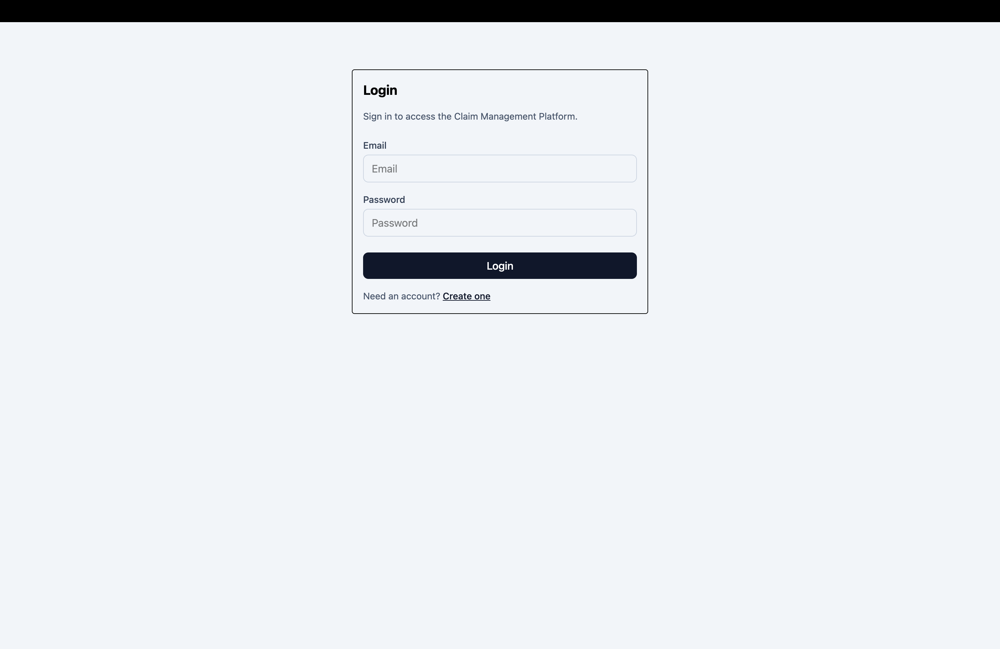
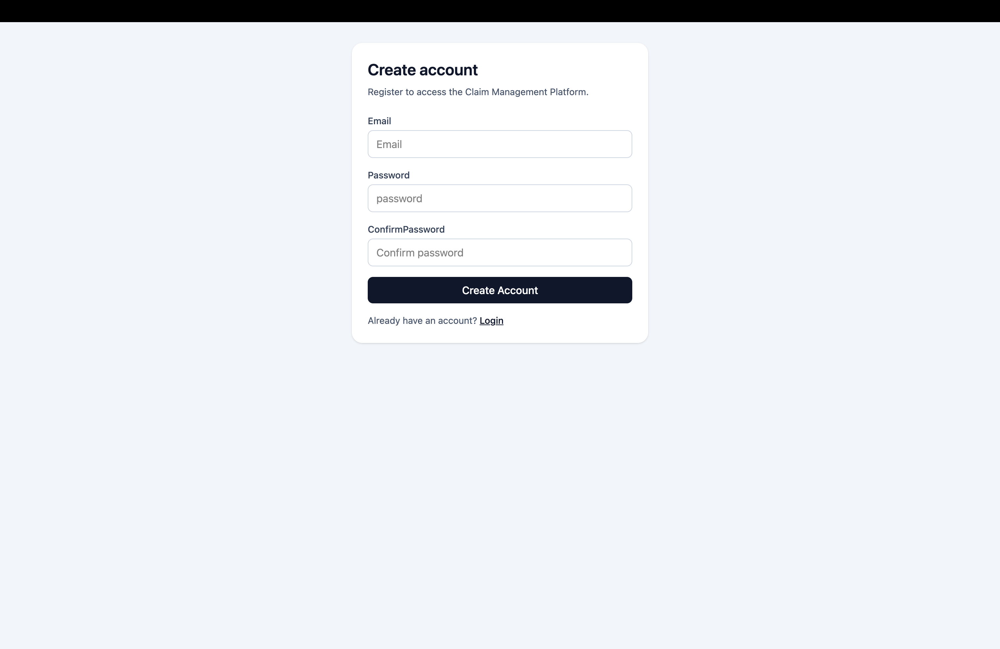
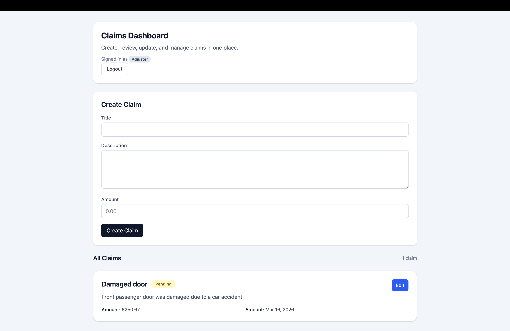
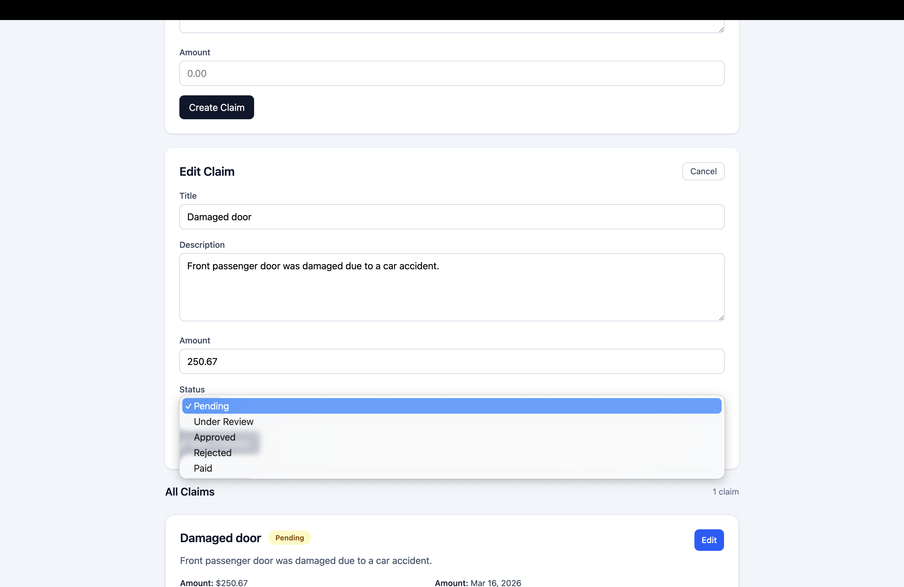

# Claim Management Platform

A full-stack claims management application built with **ASP.NET Core Web API**, **EF Core**, **SQL Server**, **React**, **TypeScript**, and **Tailwind CSS**.

This platform allows users to create, manage, and track insurance-style claims with secure authentication, role-based authorization, and a clean, responsive dashboard UI.

---

## Features

- User registration and login (JWT authentication)
- Role-based authorization (Admin / Adjuster)
- Full CRUD operations for claims
- Protected backend API endpoints
- Protected frontend routes
- Claims dashboard with status tracking
- Automated testing across backend and frontend
- Async data handling with EF Core
- Clean UI built with Tailwind CSS

---

## Tech Stack

### Backend

- ASP.NET Core Web API
- Entity Framework Core
- SQL Server (Docker)
- JWT Authentication
- xUnit (Unit Testing)
- ASP.NET Core Integration Testing

### Frontend

- React
- TypeScript
- Vite
- Tailwind CSS
- React Testing Library
- Vitest

### Tools & Dev Environment

- Docker (SQL Server container)
- Swagger (API testing)
- Postman (optional testing)

---

## Architecture Overview

### Backend Structure

- **Models** – Core domain entities (Claim, User)
- **DTOs** – Data transfer objects for request/response validation
- **Services** – Business logic layer
- **Controllers** – API endpoints
- **DbContext** – EF Core database configuration
- **Authentication** – JWT-based auth with role enforcement

### Frontend Structure

- **Pages** – Route-level components (Login, Register, Claims)
- **Components** – Reusable UI (ClaimCard, Forms, StatusBadge)
- **Services** – API communication layer
- **Context** – Auth state management
- **Utils** – Shared helpers (date formatting)

---

## Authentication & Authorization

- JWT-based authentication
- Token stored in localStorage
- Automatically attached to API requests
- Role-based access control:
  - **Admin**: full access (including delete)
  - **Adjuster**: limited access

---

## Testing

### Backend

- **Unit Tests**
  - Service-level business logic
  - Validation and rule enforcement

- **Integration Tests**
  - API endpoint testing
  - Authentication flows
  - Authorization rules

### Frontend

- **Component Tests**
  - Login form rendering and interaction
  - Error state handling
  - Claims dashboard rendering
  - API success, empty, and failure states

---

## Screenshots

- Login Page
  
- Register Page
  
- Claims Dashboard
  
- Claim Creation / Edit Form
  

---

## ⚙️ Getting Started

### Prerequisites

- Node.js
- .NET SDK
- Docker

---

### 1. Clone the repository

```bash
git clone <https://github.com/jellis777/ClaimManagementPlatform.git>
cd ClaimManagementPlatform
```

---

### 2. Start SQL Server with Docker

```bash
docker run -e "ACCEPT_EULA=Y" \
-e "MSSQL_SA_PASSWORD=YourStrong!Passw0rd" \
-p 1433:1433 \
--name claim-sql \
-d mcr.microsoft.com/mssql/server:2022-latest
```

---

### 3. Run backend

```bash
cd ClaimManagementApi
dotnet ef database update
dotnet run
```

---

### 4. Run frontend

```bash
cd claim-management-frontend
npm install
npm run dev
```

---

### 5. Run tests

#### Backend

```bash
dotnet test
```

#### Frontend

```bash
npm run test
```

---

## Future Improvements

- Azure deployment (App Service + Azure SQL)
- File upload support for claim attachments
- Admin user management dashboard
- Analytics and reporting
- Real-time updates (SignalR)

---

## Key Learnings

- Built a production-style backend architecture using ASP.NET Core
- Implemented secure JWT authentication and role-based authorization
- Designed a clean frontend using React + TypeScript + Tailwind
- Learned how to structure full-stack applications end-to-end
- Implemented testing across backend and frontend layers

---
